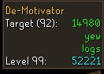

# De-Motivator: OSRS Action Counter Plugin

A custom RuneLite plugin that tracks skilling actions via Game Chat analysis and overlays precise progress toward level goals.

## 🎯 Features
* **Smart Action Detection:** Unlike standard trackers that guess based on XP drops, this plugin uses **Regex Pattern Matching** on game chat to identify exactly what you are doing (e.g., distinguishing "Oak Logs" from "Willow Logs" instantly).
* **Login Screen Support:** Features a custom overlay layer (`ABOVE_WIDGETS`) allowing configuration and previews even before logging into the game world.
* **Dynamic UI:** The overlay automatically switches context based on your active skill, preventing UI clutter.
* **Goal Tracking:** Calculates precise "Actions Remaining" for both your custom target level and Level 99.

## 🛠️ Tech Stack
* **Java 11**
* **RuneLite API** (EventBus, OverlayManager, Widget API)
* **Regex** (Pattern/Matcher for chat parsing)

## Currently supported skills
* **Woodcutting** (tested)
* **Firemaking** (tested)
* **Fishing** (not tested)
* **Mining** (not tested)
* **Prayer** (not tested)
* **Cooking** (not tested)
* **Firemaking** (not tested)
* **Herblore** (not tested)
* **Crafting(gem cutting)** (not tested)
* **Fletching** (not tested)
* **Smithing(both smelting and anvil)** (not tested)
* **Runecrafting** (not tested)

## 🚀 How to Run (Development)
1.  Clone the repository.
2.  Open in IntelliJ IDEA.
3.  Run the `ExamplePluginTest` class to launch the RuneLite developer client.
